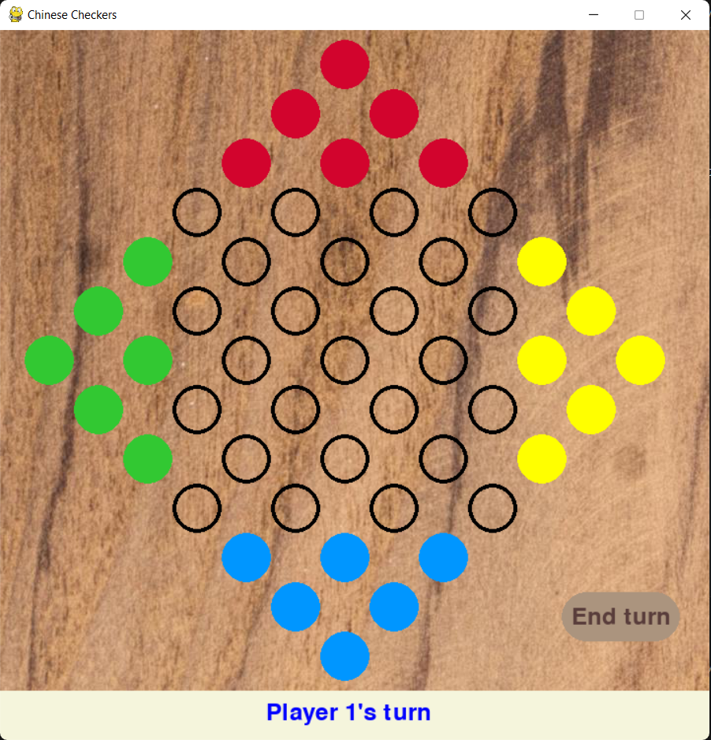

# Modified Chinese Checkers with Strategic Blocking

[](https://www.python.org/)
[](https://www.pygame.org/)
[](LICENSE)

A strategic twist on classic Chinese Checkers featuring **2/4-player modes** and **blocking mechanics**, powered by Minimax AI with Alpha-Beta pruning.




## Key Features

-  **Flexible Player Modes**: Supports both 2-player (head-to-head) and 4-player (cross formation) games
-  **Blocking Mechanics**: Special pieces that temporarily prevent opponent jumps
-  **Adaptive AI**: Minimax algorithm with:
  - Alpha-Beta pruning for optimized performance
  - Custom heuristic evaluating position, mobility, and blocking
-  **Game Analytics**: Tracks win rates, move times, and AI decision metrics

## Installation

1. **Prerequisites**:
   - Python 3.12+
   - Pygame 2.1.2+
 
2. **Setup**:
   ```bash
   git clone https://github.com/yourusername/chinese-checkers-ai.git
   cd chinese-checkers-ai
   pip install pygame numpy parameterized matplotlib

   running the code:
   for 3 AI and 1 human: python main.py --players 4 --first-player human --second-player minimax --third-player minimax --fourth-player minimax
   for 1 AI and 3 human: python main.py --players 4 --first-player human --second-player human --third-player human --fourth-player minimax
   
3. **Explanaion**:
    In cheniese Checkers a player has to move all their pegs to the opposite side of the board to win.
    As u can see in thw winningboard.png that yellow pegs wins as it managed to successfully move all its pegs to the opposite as shown in(img/board.png).
    Traditional rules allow the player to jump over an opponents peg but our modified rule does not. It forces the player to take a detour around a peg mincreasing the difficulty level of the game. 
